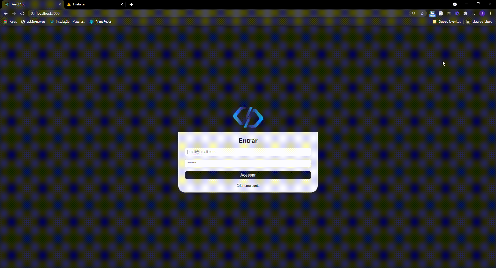

<h1 align="center">
<br>
  
<br>
<br>
SISTEMA DE CHAMADOS
</h1>

<p align="center">Sistema de gestão de chamados.</p>

<p align="center">
  <a href="https://opensource.org/licenses/MIT">
    
  </a>
</p>

<div align="center" >
  
</div>

<hr />

## Descrição

Sistema de chamados é um projeto que faz gestão de chamados dos clientes, além de fazer gestão dos forncedores e usuários.

Foi um projeto desenvolvido para praticar autenticação com banco de dados **FIREBASE**, além de utilizar outras tecnologias como **Context API** e **Styled Components**.

## Features e Status do Projeto

- [x] Configurando FIREBASE e Autenticação;
- [x] Criando Context;
- [x] Finalizando Projeto;

#### **O Projeto já foi Finalizado!**

## Clonar Projeto

Para clonar e poder instalar o projeto em sua máquina, você precisará de algumas ferramentas, como:

- [Git](https://git-scm.com)
- [Node.js](https://nodejs.org/en/).

Além disto é bom ter um editor para trabalhar com o código como [VSCode](https://code.visualstudio.com/).

### Passo a Passo para poder executar a aplicação:

- Clonar o projeto;

```bash
 git clone <repositorio>
```

- Acessar pasta do projeto pelo terminal/cmd;

```bash
cd .../callwebsistem
```

- Instale as dependências do projeto (arquivo package.json);

```bash
npm install <todas dependências>
```

- Configurar Conexão Firebase(Inserir a chave de conexão do seu Firebase);

```bash
cd src/services/firebaseConnection.js
```

- Execute a aplicação;

```bash
npm start
```

O Projeto iniciará de forma local na porta padrão do seu sistema.

## Tecnologias

As seguintes ferramentas foram usadas na construção do projeto:

- [Node.js](https://nodejs.org/en/)
- [Firebase](https://firebase.google.com/).
- [React](https://pt-br.reactjs.org/)
- [Context API](https://pt-br.reactjs.org/docs/context.html)
- [Styled Components](https://styled-components.com/)

### Autor

Feito por **João Marcos Esteves**, Desenvolvedor Web.
Aprendendo, praticando, desenvolvendo e criando.

Entre em Contato:

- [Linkedin](https://www.linkedin.com/in/joao-marcos-esteves-pereira-a5b2b317a)

## License

[MIT](https://choosealicense.com/licenses/mit/)
